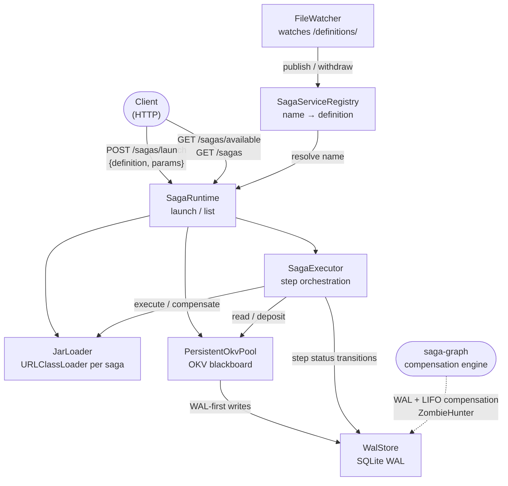
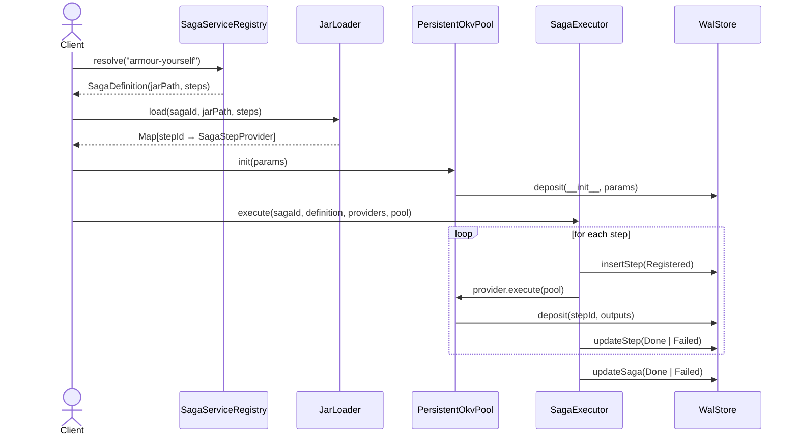
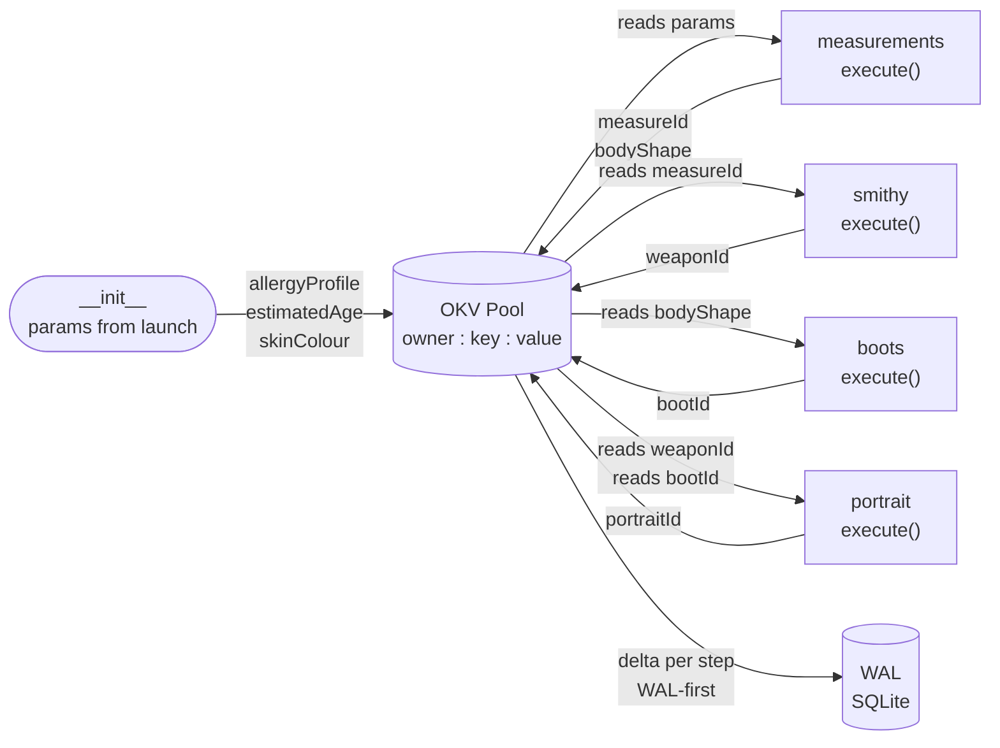
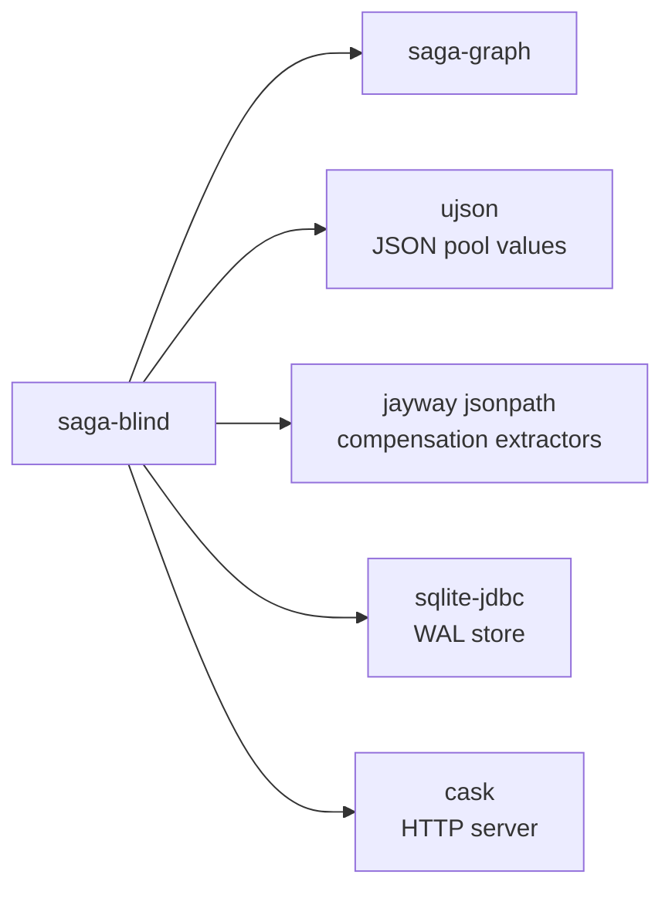

# saga-blind — Architecture

## 1. System layers

```mermaid
graph TD
    Client(["Client\n(HTTP)"])
    FW["FileWatcher\nwatches /definitions/"]
    SR["SagaServiceRegistry\nname → definition"]
    RT["SagaRuntime\nlaunch / list"]
    EX["SagaExecutor\nstep orchestration"]
    JL["JarLoader\nURLClassLoader per saga"]
    PP["PersistentOkvPool\nOKV blackboard"]
    WS["WalStore\nSQLite WAL"]
    SG(["saga-graph\ncompensation engine"])

    Client -->|"POST /sagas/launch\n{definition, params}"| RT
    Client -->|"GET /sagas/available\nGET /sagas"| RT

    FW -->|"publish / withdraw"| SR
    SR -->|"resolve name"| RT

    RT --> EX
    RT --> JL
    RT --> PP

    EX -->|"execute / compensate"| JL
    EX -->|"read / deposit"| PP
    PP -->|"WAL-first writes"| WS
    EX -->|"step status transitions"| WS

    SG -.->|"WAL + LIFO compensation\nZombieHunter"| WS
```

## 2. Saga launch flow

```mermaid
sequenceDiagram
    actor Client
    participant SR as SagaServiceRegistry
    participant JL as JarLoader
    participant PP as PersistentOkvPool
    participant EX as SagaExecutor
    participant WAL as WalStore

    Client->>SR: resolve("armour-yourself")
    SR-->>Client: SagaDefinition(jarPath, steps)

    Client->>JL: load(sagaId, jarPath, steps)
    JL-->>Client: Map[stepId → SagaStepProvider]

    Client->>PP: init(params)
    PP->>WAL: deposit(__init__, params)

    Client->>EX: execute(sagaId, definition, providers, pool)

    loop for each step
        EX->>WAL: insertStep(Registered)
        EX->>PP: provider.execute(pool)
        PP->>WAL: deposit(stepId, outputs)
        EX->>WAL: updateStep(Done | Failed)
    end

    EX->>WAL: updateSaga(Done | Failed)
```

## 3. OKV pool data flow

```mermaid
graph LR
    INIT(["__init__\nparams from launch"])
    A["measurements\nexecute()"]
    B["smithy\nexecute()"]
    C["boots\nexecute()"]
    D["portrait\nexecute()"]

    POOL[("OKV Pool\nowner : key : value")]
    WAL[("WAL\nSQLite")]

    INIT -->|"allergyProfile\nestimatedAge\nskinColour"| POOL
    POOL -->|"reads params"| A
    A -->|"measureId\nbodyShape"| POOL
    POOL -->|"reads measureId"| B
    POOL -->|"reads bodyShape"| C
    B -->|"weaponId"| POOL
    C -->|"bootId"| POOL
    POOL -->|"reads weaponId\nreads bootId"| D
    D -->|"portraitId"| POOL

    POOL -->|"delta per step\nWAL-first"| WAL
```

## 4. Dependencies

```mermaid
graph LR
    SB["saga-blind"]
    SG["saga-graph"]
    UJ["ujson\nJSON pool values"]
    JP["jayway jsonpath\ncompensation extractors"]
    SQ["sqlite-jdbc\nWAL store"]
    CK["cask\nHTTP server"]

    SB --> SG
    SB --> UJ
    SB --> JP
    SB --> SQ
    SB --> CK
```
