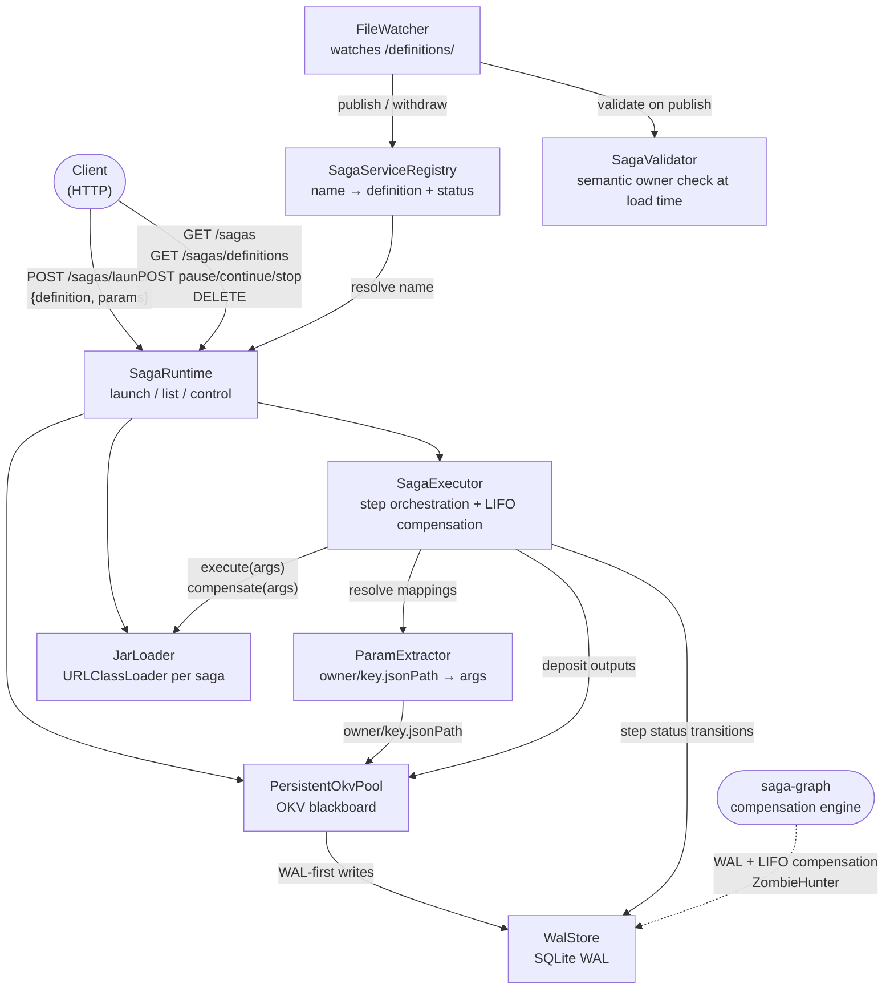
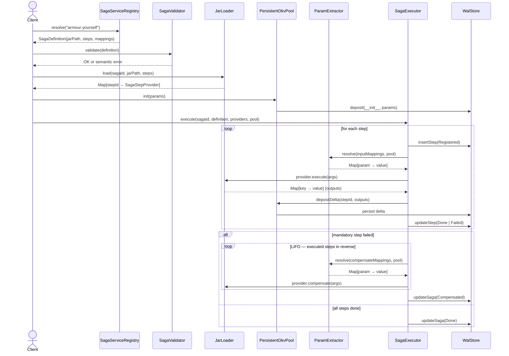
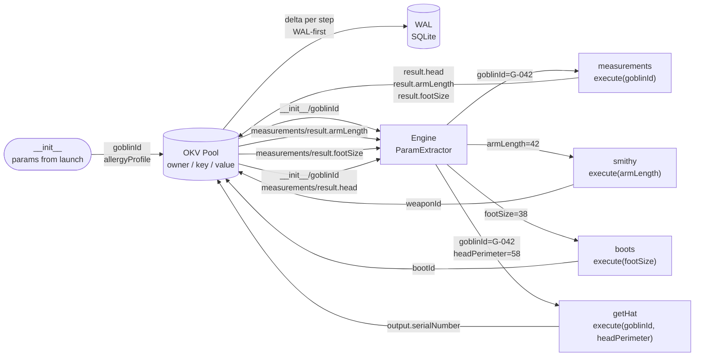
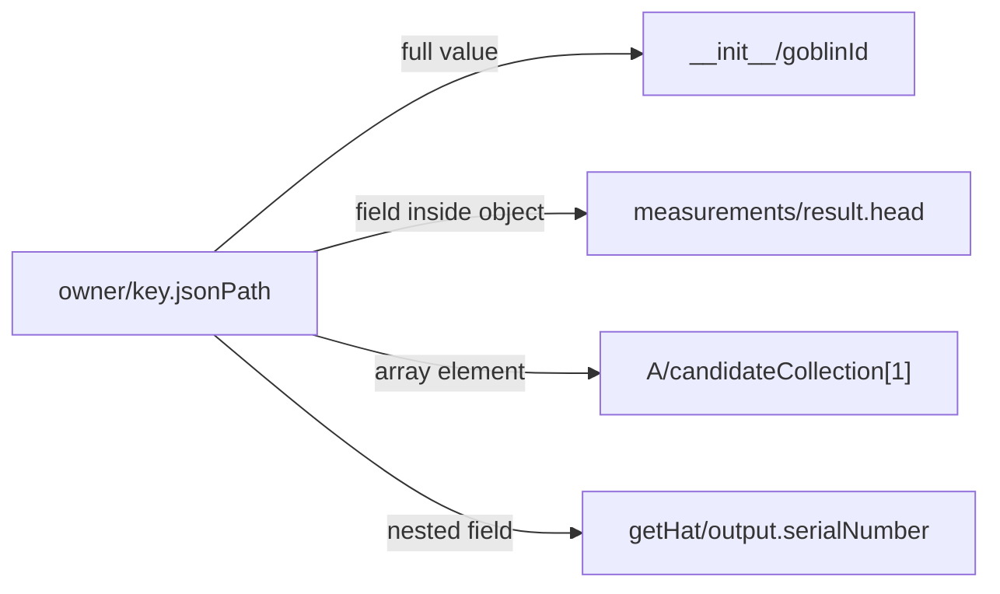
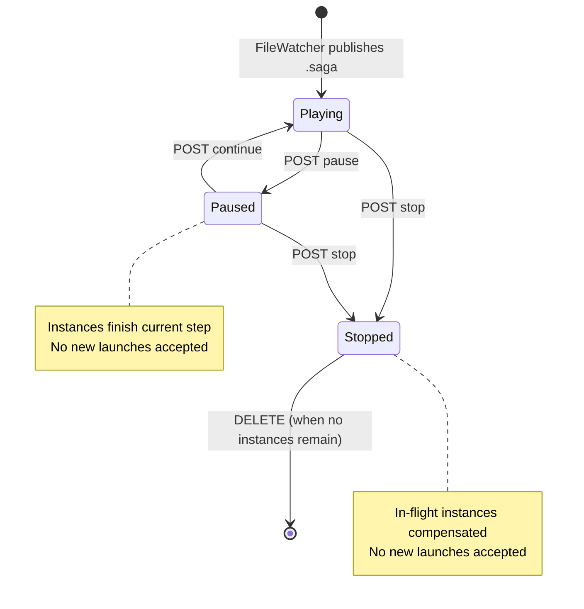
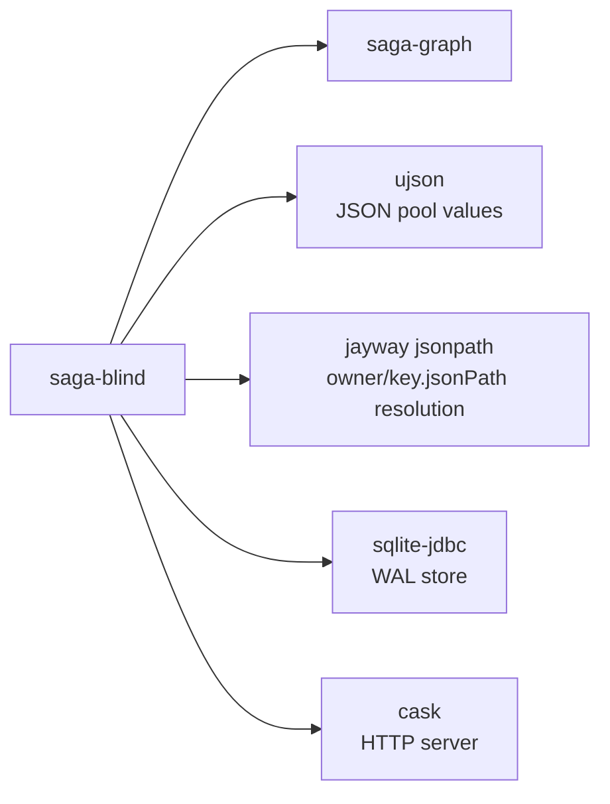

# saga-blind — Architecture

## 1. System layers

```mermaid
graph TD
    Client(["Client\n(HTTP)"])
    FW["FileWatcher\nwatches /definitions/"]
    SR["SagaServiceRegistry\nname → definition + status"]
    SV["SagaValidator\nsemantic owner check at load time"]
    RT["SagaRuntime\nlaunch / list / control"]
    EX["SagaExecutor\nstep orchestration + LIFO compensation"]
    PE["ParamExtractor\nowner/key.jsonPath → args"]
    JL["JarLoader\nURLClassLoader per saga"]
    PP["PersistentOkvPool\nOKV blackboard"]
    WS["WalStore\nSQLite WAL"]
    SG(["saga-graph\ncompensation engine"])

    Client -->|"POST /sagas/launch\n{definition, params}"| RT
    Client -->|"GET /sagas\nGET /sagas/definitions\nPOST pause/continue/stop\nDELETE"| RT

    FW -->|"publish / withdraw"| SR
    FW -->|"validate on publish"| SV
    SR -->|"resolve name"| RT

    RT --> EX
    RT --> JL
    RT --> PP

    EX -->|"resolve mappings"| PE
    PE -->|"owner/key.jsonPath"| PP
    EX -->|"execute(args)\ncompensate(args)"| JL
    EX -->|"deposit outputs"| PP
    PP -->|"WAL-first writes"| WS
    EX -->|"step status transitions"| WS

    SG -.->|"WAL + LIFO compensation\nZombieHunter"| WS
```

## 2. Saga launch flow

```mermaid
sequenceDiagram
    actor Client
    participant SR as SagaServiceRegistry
    participant SV as SagaValidator
    participant JL as JarLoader
    participant PP as PersistentOkvPool
    participant PE as ParamExtractor
    participant EX as SagaExecutor
    participant WAL as WalStore

    Client->>SR: resolve("armour-yourself")
    SR-->>Client: SagaDefinition(jarPath, steps, mappings)

    Client->>SV: validate(definition)
    SV-->>Client: OK or semantic error

    Client->>JL: load(sagaId, jarPath, steps)
    JL-->>Client: Map[stepId → SagaStepProvider]

    Client->>PP: init(params)
    PP->>WAL: deposit(__init__, params)

    Client->>EX: execute(sagaId, definition, providers, pool)

    loop for each step
        EX->>WAL: insertStep(Registered)
        EX->>PE: resolve(inputMappings, pool)
        PE-->>EX: Map[param → value]
        EX->>JL: provider.execute(args)
        JL-->>EX: Map[key → value] (outputs)
        EX->>PP: depositDelta(stepId, outputs)
        PP->>WAL: persist delta
        EX->>WAL: updateStep(Done | Failed)
    end

    alt mandatory step failed
        loop LIFO — executed steps in reverse
            EX->>PE: resolve(compensateMappings, pool)
            PE-->>EX: Map[param → value]
            EX->>JL: provider.compensate(args)
        end
        EX->>WAL: updateSaga(Compensated)
    else all steps done
        EX->>WAL: updateSaga(Done)
    end
```

## 3. OKV pool data flow

```mermaid
graph LR
    INIT(["__init__\nparams from launch"])
    A["measurements\nexecute(goblinId)"]
    B["smithy\nexecute(armLength)"]
    C["boots\nexecute(footSize)"]
    D["getHat\nexecute(goblinId, headPerimeter)"]

    POOL[("OKV Pool\nowner / key / value")]
    WAL[("WAL\nSQLite")]
    ENGINE["Engine\nParamExtractor"]

    INIT -->|"goblinId\nallergyProfile"| POOL
    POOL -->|"__init__/goblinId"| ENGINE
    ENGINE -->|"goblinId=G-042"| A
    A -->|"result.head\nresult.armLength\nresult.footSize"| POOL

    POOL -->|"measurements/result.armLength"| ENGINE
    ENGINE -->|"armLength=42"| B
    B -->|"weaponId"| POOL

    POOL -->|"measurements/result.footSize"| ENGINE
    ENGINE -->|"footSize=38"| C
    C -->|"bootId"| POOL

    POOL -->|"__init__/goblinId\nmeasurements/result.head"| ENGINE
    ENGINE -->|"goblinId=G-042\nheadPerimeter=58"| D
    D -->|"output.serialNumber"| POOL

    POOL -->|"delta per step\nWAL-first"| WAL
```

## 4. Parameter mapping syntax

```mermaid
graph LR
    A["owner/key.jsonPath"]
    B["__init__/goblinId"]
    C["measurements/result.head"]
    D["A/candidateCollection[1]"]
    E["getHat/output.serialNumber"]

    A -->|"full value"| B
    A -->|"field inside object"| C
    A -->|"array element"| D
    A -->|"nested field"| E
```

## 5. Definition lifecycle

```mermaid
stateDiagram-v2
    [*] --> Playing : FileWatcher publishes .saga
    Playing --> Paused : POST pause
    Paused --> Playing : POST continue
    Playing --> Stopped : POST stop
    Paused --> Stopped : POST stop
    Stopped --> [*] : DELETE (when no instances remain)

    note right of Paused
        Instances finish current step
        No new launches accepted
    end note

    note right of Stopped
        In-flight instances compensated
        No new launches accepted
    end note
```

## 6. Dependencies

```mermaid
graph LR
    SB["saga-blind"]
    SG["saga-graph"]
    UJ["ujson\nJSON pool values"]
    JP["jayway jsonpath\nowner/key.jsonPath resolution"]
    SQ["sqlite-jdbc\nWAL store"]
    CK["cask\nHTTP server"]

    SB --> SG
    SB --> UJ
    SB --> JP
    SB --> SQ
    SB --> CK
```
