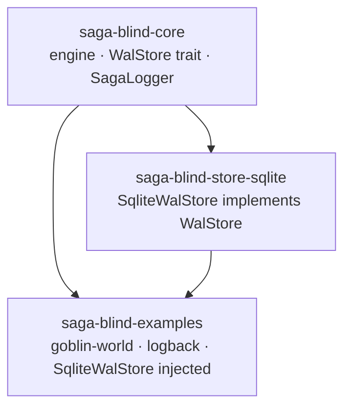
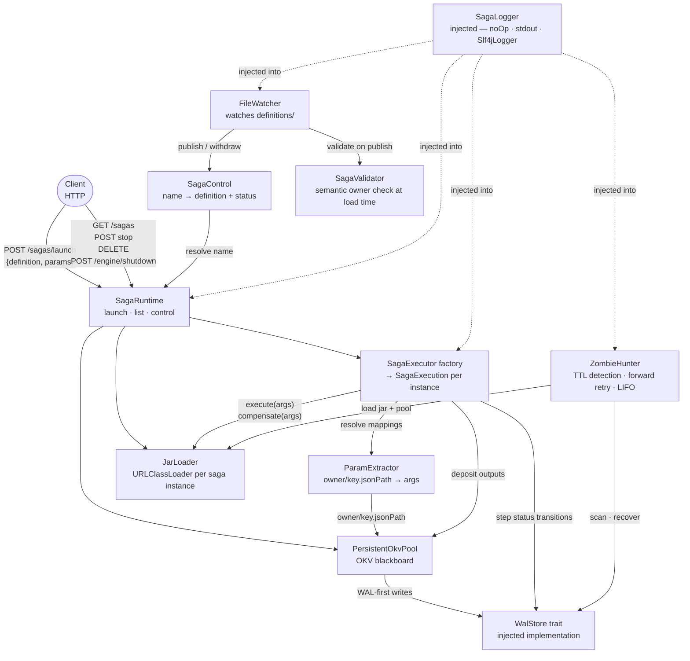
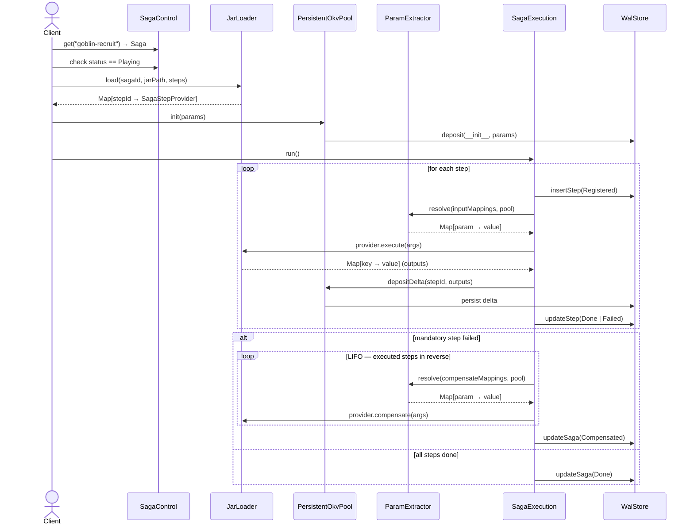
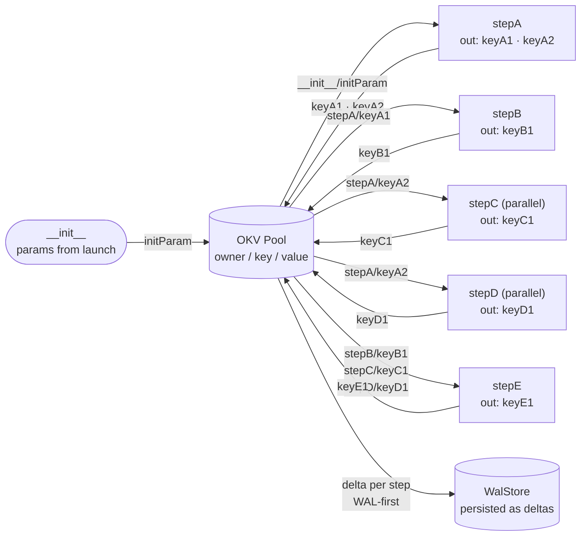
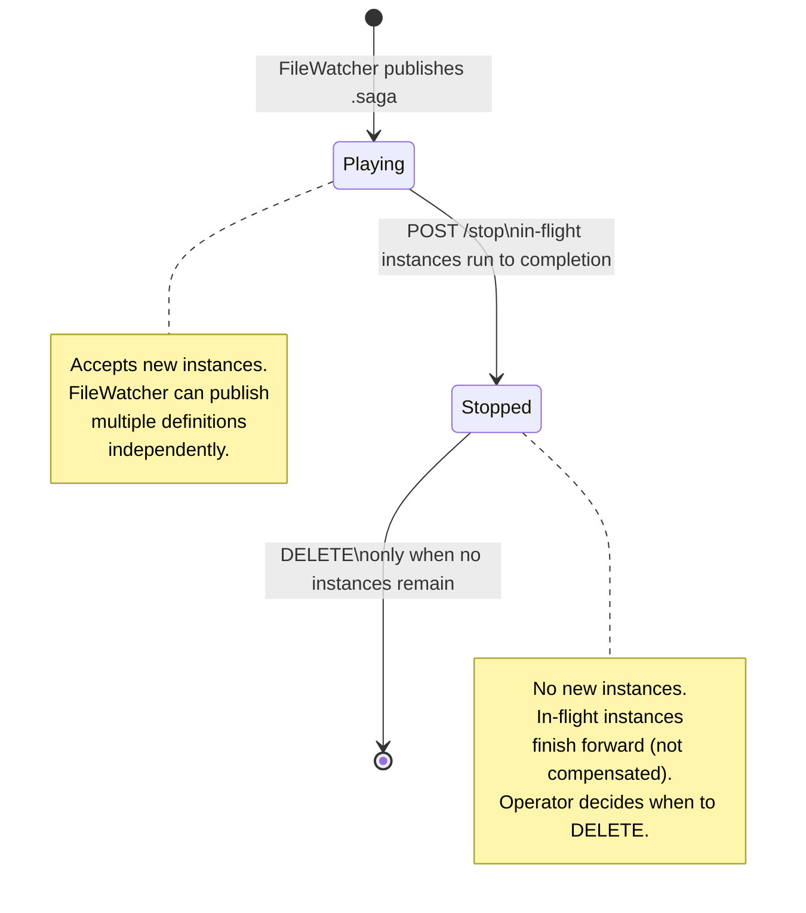
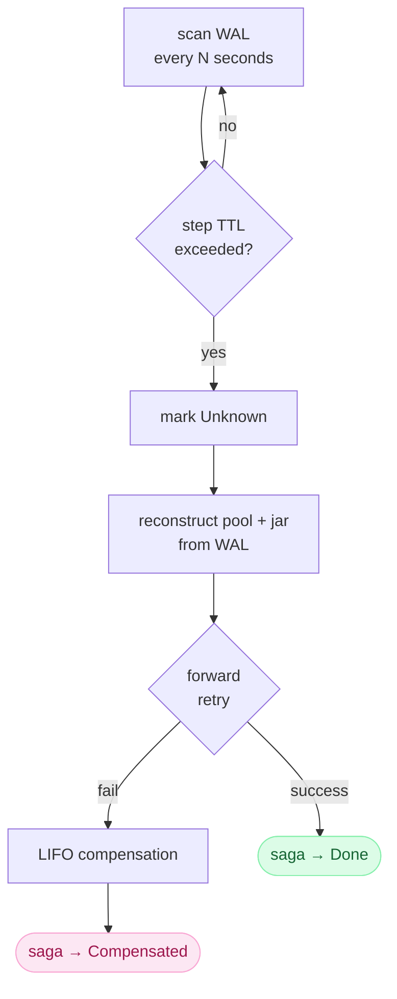
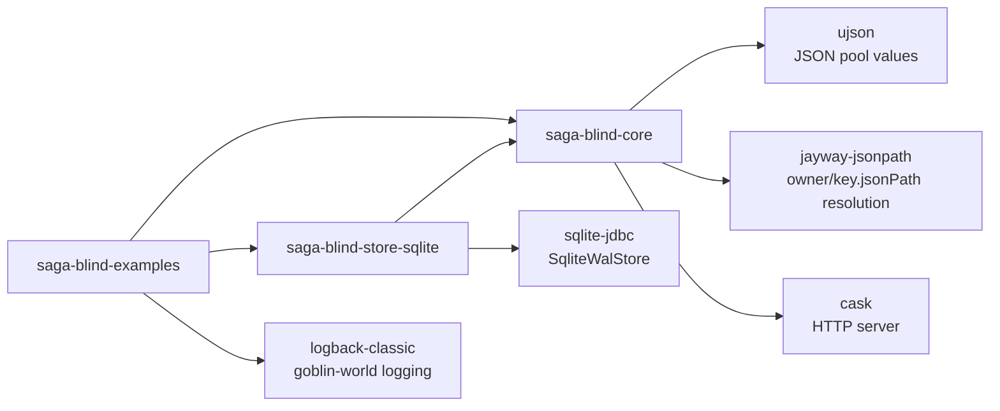

# saga-blind — Architecture

## Videos

| Video | Description |
|-------|-------------|
| [saga.mp4](saga.mp4) | The engine — loading a definition and processing a request |
| [dsl-tour.mp4](dsl-tour.mp4) | How a single DSL line becomes a step dependency |
| [okv-tour.mp4](okv-tour.mp4) | The OKV pool filling step by step |
| [lifo-tour.mp4](lifo-tour.mp4) | LIFO compensation when a step fails |
| [zh-tour.mp4](zh-tour.mp4) | ZombieHunter — TTL detection and recovery |
| [saga-blind-console-demo.mp4](saga-blind-console-demo.mp4) | Live demo — engine, launch, logs, shutdown |

---

## 1. Module structure



The engine (`core`) has no database driver and no logging implementation.
Both are injected by the caller — `examples` injects `SqliteWalStore` and `Slf4jLogger`.

---

## 2. System layers



---

## 3. Saga launch flow



---

## 4. Parameter mapping syntax

```
owner/key.jsonPath
```

| expression | owner | key | jsonPath | example |
|---|---|---|---|---|
| `__init__/goblinId` | `__init__` | `goblinId` | — | full value from launch params |
| `measurements/result.head` | `measurements` | `result` | `.head` | field inside object |
| `A/candidateCollection[1]` | `A` | `candidateCollection` | `[1]` | array element |
| `getHat/output.serialNumber` | `getHat` | `output` | `.serialNumber` | nested field |

The engine resolves these mappings before each call. If a mapping references a key that has not been deposited yet, the step fails with a clear error.

**Semantic validation at load time:** a step cannot reference an owner that appears later in the definition. Steps in a parallel block cannot reference their siblings. Detected at publish time, before any instance runs.

**Self-reference in compensate:** a step's `compensateMappings` may reference its own id — because when compensation runs, the step has already executed and deposited its outputs.

---

## 5. OKV pool data flow

→ See also: [okv-tour.mp4](okv-tour.mp4)



---

## 6. Definition lifecycle



---

## 7. ZombieHunter recovery

→ See also: [zh-tour.mp4](zh-tour.mp4)



ZombieHunter never touches: `Stopped` · `Done` · `Compensated` · `Failed`

---

## 8. Log format

```
HH:mm:ss.SSS  LEVEL  [thread]  [logger]  [component]  [sagaId]  message
```

```
10:05:07.612 INFO  [XNIO-1]   [sagablind] [engine] [a3f2c1d8] saga 'my-saga' started
10:05:07.615 INFO  [XNIO-1]   [sagablind] [engine] [a3f2c1d8] → 'stepA' {paramX:"value"}
10:05:07.929 INFO  [XNIO-1]   [sagablind] [engine] [a3f2c1d8] ← 'stepA' done {keyA1:58, keyA2:42}
10:05:07.931 INFO  [XNIO-1]   [sagablind] [engine] [a3f2c1d8] ⇉ parallel [stepC, stepD]
10:05:07.950 INFO  [global-1] [sagablind] [engine] [a3f2c1d8] → 'stepC' {paramY:42}
10:05:07.950 INFO  [global-2] [sagablind] [engine] [a3f2c1d8] → 'stepD' {paramZ:38}
10:05:08.172 INFO  [XNIO-1]   [sagablind] [engine] [a3f2c1d8] ⇇ parallel [stepC, stepD] joined
10:05:09.004 INFO  [XNIO-1]   [sagablind] [engine] [a3f2c1d8] saga 'my-saga' done
```

Filter by sagaId to get the full history of one instance:
```bash
grep "a3f2c1d8" saga-blind.log
```

---

## 9. Dependencies



`core` has no database driver and no logging implementation.
Both are compile-time dependencies of `store-sqlite` and `examples` respectively.
