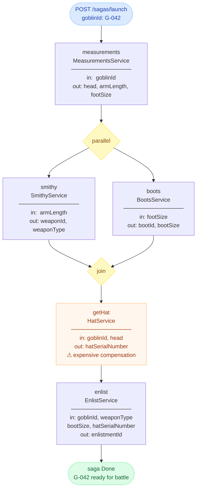
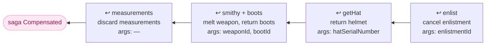

# goblin-recruit

Arms and enlists a goblin for battle.

Demonstrates: sequential steps, parallel block, param mapping between steps, LIFO compensation with args from the OKV.

→ Live demo: [saga-blind-console-demo.mp4](saga-blind-console-demo.mp4)

## Saga flow



## Compensation (LIFO)

→ See also: [lifo-tour.mp4](lifo-tour.mp4)

If any mandatory step fails, compensation runs in reverse:



## OKV data flow

→ See also: [okv-tour.mp4](okv-tour.mp4)

Each step reads from owners that already executed and deposits its own outputs.

```mermaid
flowchart LR
    INIT["__init__\ngoblinId"]

    INIT -->|goblinId| M["measurements\nhead · armLength · footSize"]

    M -->|armLength| S["smithy\nweaponId · weaponType"]
    M -->|footSize|  B["boots\nbootId · bootSize"]
    M -->|head|      H
    INIT -->|goblinId| H["getHat\nhatSerialNumber"]

    S -->|weaponType|      E["enlist\nenlistmentId"]
    B -->|bootSize|        E
    H -->|hatSerialNumber| E
    INIT -->|goblinId|     E
```

## Step parameters

| step | kind | inputs (from OKV) | outputs (to OKV) | compensate args |
|------|------|-------------------|------------------|-----------------|
| measurements | mandatory | `__init__/goblinId` | head, armLength, footSize | — |
| smithy | mandatory | `measurements/armLength` | weaponId, weaponType | `smithy/weaponId` |
| boots | mandatory | `measurements/footSize` | bootId, bootSize | `boots/bootId` |
| getHat | mandatory | `__init__/goblinId`, `measurements/head` | hatSerialNumber | `getHat/hatSerialNumber` |
| enlist | mandatory | `__init__/goblinId`, `smithy/weaponType`, `boots/bootSize`, `getHat/hatSerialNumber` | enlistmentId | `enlist/enlistmentId` |
